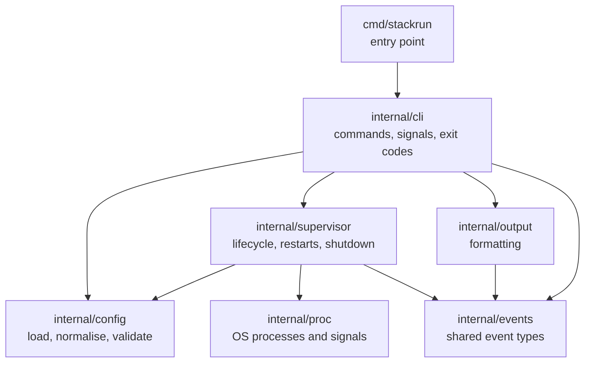
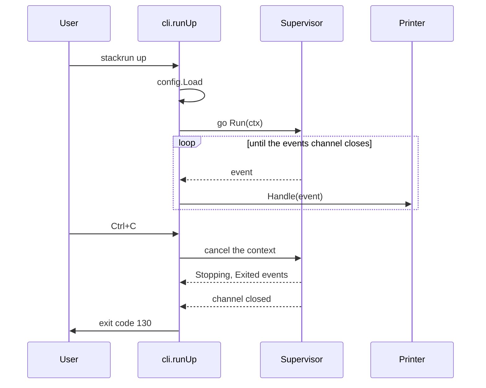
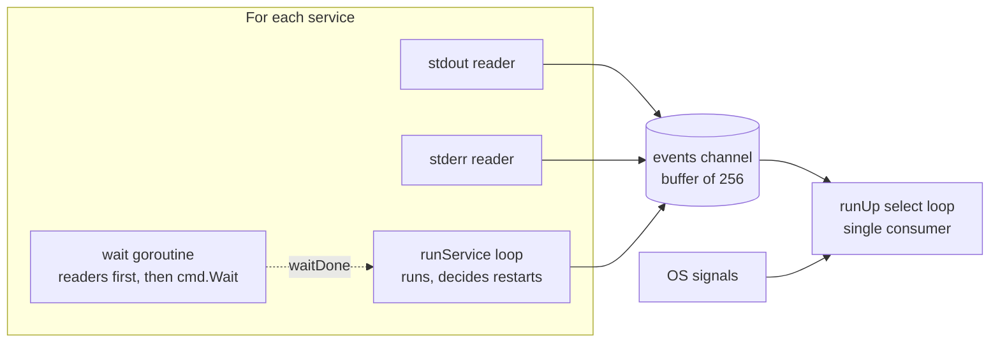
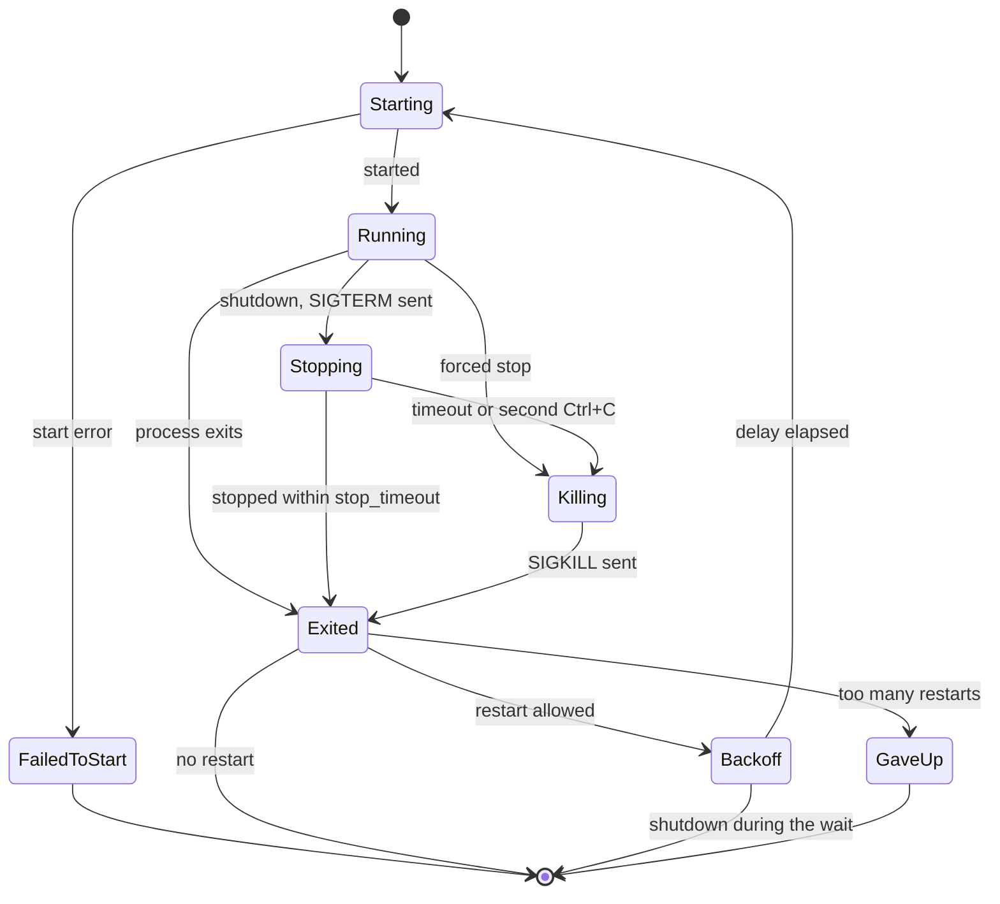

# stackrun architecture

This document explains how stackrun is built and why. It is written for
contributors and for anyone curious about how a process manager works
internally.

## Goals and non-goals

**Goals**

- Run several local development services from one config file.
- Show their output in one aligned, colour-coded stream.
- Restart crashed services without creating tight crash loops.
- Shut down cleanly, leaving **no orphaned processes**. This is the most
  important quality requirement.

**Non-goals**

- Running containers, or managing production deployments.
- Managing processes on remote machines.

## Package structure

| Package | Responsibility |
|---|---|
| `cmd/stackrun` | Calls the CLI and turns its error into an exit code. Nothing else. |
| `internal/cli` | Cobra commands, signal handling, and exit code mapping. Wires the other packages together. |
| `internal/config` | Turns a YAML file into a validated `Config`. |
| `internal/supervisor` | Runs services, restarts them, stops them, and reports everything as events. |
| `internal/proc` | The operating system layer: builds commands, creates process groups, sends signals. |
| `internal/output` | Formats events as text for a terminal. |
| `internal/events` | The vocabulary shared by the supervisor and its consumers. |

Two dependency rules keep the design flexible:

- **The supervisor never prints, and the printer never manages processes.**
  They communicate only through `events.Event` values. A different consumer,
  such as a terminal dashboard, could replace the printer without changing
  the supervisor.
- **`proc` does not import `config`.** It receives a small `Spec` struct, so
  changes to the config format cannot affect process creation.

Everything lives under `internal/`, which the Go compiler prevents other
modules from importing. The internal design can change freely without
breaking anyone.

## Request flow for `stackrun up`

## Configuration pipeline

`config.Load` runs three separate stages:

1. **Parse:** strict YAML decoding. Unknown fields are rejected, so typos are
   reported instead of silently ignored.
2. **Normalise:** fills in defaults (`restart: never`, `stop_timeout: 10s`),
   copies map keys into service names, and makes directories absolute,
   relative to the config file rather than the current directory.
3. **Validate:** checks rules YAML cannot express, and collects **every**
   problem before returning, using `errors.Join` and a typed `FieldError`.

Keeping validation separate from file reading makes it a pure function over
a struct, so its tests build configs directly in Go.

Go randomises map iteration order, so every loop over services goes through
`Config.ServiceNames`, which returns sorted names. This keeps output, colour
assignment, and error messages deterministic.

## Concurrency model

Each service has its own goroutines:

- **Two readers** forward stdout and stderr line by line as `Output` events.
- **A wait goroutine** waits for both readers to finish, then calls
  `cmd.Wait`. The order matters: `Wait` closes the pipes, so calling it
  while readers are still reading can lose the final lines of output.
- **The service loop** supervises the process, reacts to shutdown, and
  decides whether to restart.

All goroutines send into **one buffered channel**. When it is full, senders
wait, which bounds memory use (backpressure). `Run` closes the channel only
after every service goroutine has finished, because sending on a closed
channel panics. The consumer's `for` loop ends when the channel closes.

The CLI handles events and OS signals in **one `select` loop**, so state
such as "has a signal already been received" is never shared between
goroutines and needs no locking. The printer still uses a mutex, so it stays
safe even if a future consumer calls it concurrently.

**Long lines:** a custom `bufio.Scanner` split function returns lines longer
than 1 MB in chunks instead of failing. If stackrun ever stopped reading, the
pipe would fill and the service would block forever on its next write, so a
pipe is never abandoned.

## Service lifecycle

## Shutdown

### Process groups

A service such as `npm run dev` is really a tree of processes:
`/bin/sh` starts `npm`, which starts `node`. Signalling only the shell would
leave the rest running as orphans.

`proc` starts every service with `Setpgid`, which places it in a **new
process group** whose ID equals the shell's PID. Signals are sent to the
negative PID, which addresses the whole group, reaching every process in the
tree. Because services have their own groups, the terminal's Ctrl+C reaches
only stackrun, which then controls the shutdown order and messages.

### Sequence

Cancelling the context starts shutdown in every service goroutine at once,
so services stop in parallel and the total wait is the longest timeout, not
the sum. Each service:

1. Sends **SIGTERM** to its group.
2. Waits for the process to exit, its `stop_timeout` to pass, or a force
   request.
3. Sends **SIGKILL** to its group if it is still running.
4. If the output pipes are still open shortly after the kill (a process that
   escaped its group may hold them), closes them, so stackrun cannot hang.

A second Ctrl+C calls `ForceStop`, which closes a channel. A closed channel
can be received from by any number of goroutines, so it acts as a broadcast,
and `sync.Once` guarantees it is closed only once.

### Process ID reuse

Once `cmd.Wait` has reaped a process, its ID may eventually be reused by an
unrelated process. stackrun only signals before the wait result arrives.
There is a theoretical window of microseconds where the process has been
reaped but the result has not been received. Operating systems allocate IDs
sequentially and do not reuse one immediately, so the practical risk is
negligible, and removing it entirely would require platform-specific system
calls.

## Restarts

Restart decisions are **pure functions** in `supervisor/restart.go`, with no
processes involved:

- `shouldRestart(policy, outcome)`: a service stopped by stackrun never
  restarts. Otherwise `always` restarts every time, and `on-failure` restarts
  after a non-zero exit or a crash.
- `backoffDelay(attempt)`: 1s doubling to a 30s cap. It doubles in a loop
  and returns at the cap, avoiding the integer overflow that a bit shift
  would hit for large attempt numbers.
- `nextAttempt(previous, runDuration)`: a run of at least 10 seconds resets
  the count, so a healthy service that crashes occasionally is not given up
  on.

The backoff wait uses the same three-way `select` as shutdown (timer,
context, force), so Ctrl+C interrupts it immediately. Start failures are
never retried, because retrying a missing directory fails the same way every
time.

## Error handling and exit codes

- Errors are wrapped with `%w`, and checked with `errors.Is` and
  `errors.As`, never by comparing message text.
- Validation returns all problems together as `FieldError` values joined
  with `errors.Join`.
- Cobra's own error printing is disabled. `cli.Execute` prints ordinary
  errors, while an internal `exitError` carries a specific exit code without
  printing a message, since shutdown output has already explained what
  happened.
- Exit codes follow Unix conventions: `0` success, `1` failure, and
  128 plus the signal number after a signal (130 for SIGINT, 143 for SIGTERM).

## Testing strategy

| Level | What it covers | Example |
|---|---|---|
| Pure unit tests | Decision logic with no I/O, in table-driven style | Restart policy table, backoff sequence, validation rules |
| Formatting tests | Output written to a buffer instead of a terminal | Prefix alignment, colour on and off |
| Integration tests | Real processes started through the real code paths | Exit codes, stderr capture, long lines, restarts |
| Unix-only tests | Signals and process groups, behind `//go:build unix` | Group-wide SIGTERM, SIGKILL fallback, no orphans |

Principles used throughout:

- **Inject what makes code hard to test.** Restart limits are a struct field
  that tests set to milliseconds. The CLI's signal channel is a parameter, so
  tests send a fake SIGINT.
- **Wait for explicit readiness, never for time.** Tests that signal a
  process first wait for it to print `ready` or write a file, which removes
  race conditions between process startup and the test.
- **Prove the important property directly.** The orphan test reads the PID of
  a background child process and asks the operating system whether it still
  exists after shutdown.
- **Clean up on failure.** `t.Cleanup` force-stops supervisors, so a failing
  test never leaves processes running.
- **Race detection everywhere.** All tests run with `-race`, on Linux and
  macOS in CI.

## Key design decisions

| Decision | Alternative considered | Reason |
|---|---|---|
| Event channel between supervisor and output | Supervisor printing directly | Keeps process management independent of presentation |
| Run commands through `/bin/sh -c` | Split arguments and exec directly | Users expect pipes, `&&` and variables to work as in a terminal |
| One process group per service | Signalling only the shell | Reaches the whole process tree, preventing orphans |
| Context cancellation for shutdown | Custom stop flags per service | The standard Go mechanism, observed by every goroutine at once |
| Read pipes fully before `cmd.Wait` | Calling `Wait` immediately | Required by `os/exec`; otherwise final output can be lost |
| Stdin connected to the null device | Inheriting the terminal | Prevents services competing for keyboard input, and avoids processes being paused when reading from a terminal outside their group |
| Strict YAML with unknown fields rejected | Permissive decoding | Typos are reported instead of silently ignored |
| Fixed restart limits | Configurable per service | Avoids configuration nobody needs yet; all limits live in one struct, so making them configurable later is small |
| `go.yaml.in/yaml/v3` | The v4 release candidate | v3 is stable and still receives security fixes |
| Inline, justified `//nolint:gosec` | Disabling rules globally | stackrun runs the user's own commands by design; suppressing only those lines keeps real findings visible elsewhere |

## Known limitations

- If stackrun itself receives SIGKILL, it cannot stop its services. Linux
  offers a partial workaround (a parent-death signal) that macOS does not.
- Processes that move themselves into a new group or session escape group
  signals. The pipe-closing safety net still prevents stackrun from hanging.
- Windows is not supported yet. The `proc` package has a Windows
  implementation that compiles but reports the platform as unsupported;
  supporting it would use Job Objects in place of process groups.